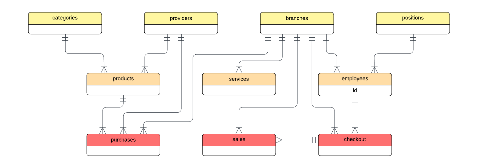
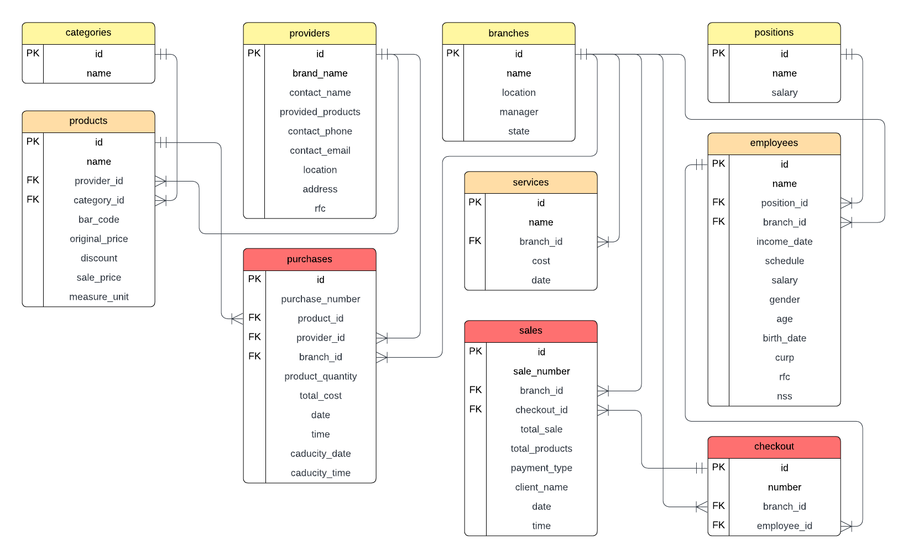
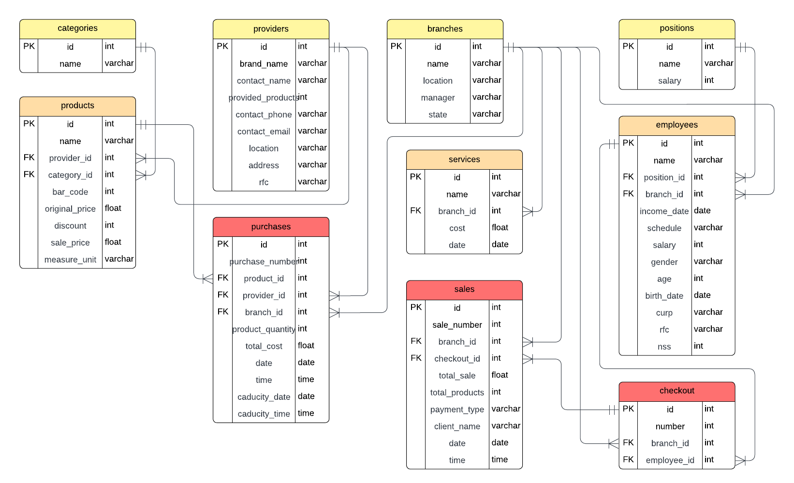
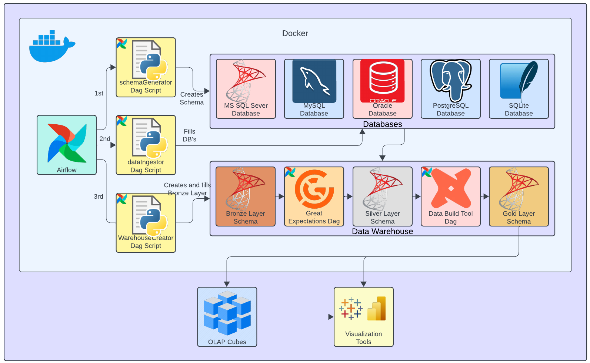

[](https://www.python.org/)
[](https://www.mysql.com/)
[](https://airflow.apache.org/)
[](https://www.microsoft.com/en-us/sql-server)
[](https://www.postgresql.org/)
[](https://www.mysql.com/)
[](https://www.sqlite.org/index.html)
[](https://www.oracle.com/database/)
[](https://www.docker.com/)
[]()
[](https://greatexpectations.io/)
[](https://www.getdbt.com/)
[](https://faker.readthedocs.io/en/master/)

# Data Warehouse creation ETL Pipeline

This project aims to create an entire functional ETL Pipeline for building a Data Warehouse system to be used for data analysis and reporting. It begins from orchestrating a workflow using Apache Airflow, includes schema generation for various database engines, data ingestion using generated dummy data, and loading data into a centralized Microsoft SQL Server Data Warehouse.

Initially, the focus was only on Microsoft SQL Server, but the project has been expanded to support additional DBMS, including MySQL, PostgreSQL, Oracle XE, and SQLite. The architecture is containerized using Docker and Docker Compose, facilitating easy deployment and scalability. Future stages will extend into data quality assurance and business intelligence.

### Original Project

The original version of this project consisted of manually executed Python scripts focusing primarily on SQL Server and basic data modeling. These scripts, along with early-stage SQL definitions and diagrams, are preserved in the documentation/Original Project Files/ directory for reference.

The original project laid the groundwork for this pipeline, focusing on the extraction, transformation, and loading of data from various transactional sources into an initial database schema. While it served its fundamental purpose, a re-evaluation of its architecture revealed significant opportunities to enhance scalability, robustness, and adherence to best practices in Data Warehouse design. This initial project served as a functional prototype that validated the feasibility of an ETL pipeline approach.

### Evolution of the Project

This new version evolves into a modular, fully Dockerized system, introducing Apache Airflow for orchestration and Python scripts organized by functionality (schema creation, ingestion, transformation). Each script is built to support multiple database engines, making the system scalable and adaptable.

More specifically featuring:

Multiple database engines: MSSQL, MySQL, PostgreSQL, Oracle XE, and SQLite.

An Airflow container orchestrating the ETL pipeline.

Modular Python scripts for data extraction, transformation, and loading.

Persistent volumes for data storage, ensuring data durability across container restarts.

A structured directory layout separating concerns such as DAGs, scripts, SQL files, and documentation.

### Data Modeling

Data modeling is a critical phase in this project. The data model of the Databases that are not the Data Warehouse are centered around a fictional supermarket chain (this was inherited from the original project), encompassing transactional data (e.g., sales, inventory, purchases) and master data (e.g., products, employees, stores). Entity-Relationship (ER) diagrams illustrating the conceptual and logical models are available in the documentation/ folder. These models are implemented across all supported DBMS to ensure consistency.







### ETL Building

The construction of the ETL (Extract, Transform, Load) process is the core of this project. **Apache Airflow** is used as the primary orchestrator to schedule and monitor data workflows (DAGs). Python scripts are responsible for extracting data from operational sources, transforming it for cleaning, normalization, and aggregation, and finally, loading it into the Data Warehouse layers.The groundwork is being laid to integrate advanced data quality tools and transformations in future stages.



The ETL process is organized into these three Airflow DAGs (by now):
- **DAG 1:** Schema generation for each source database.
- **DAG 2:** Data ingestion using dummy data generated with `Faker`.
- **DAG 3:** Creation and population of the Data Warehouse (MsSQLServer).

Not implemented yet Airflow DAGs:
- **DAG 4:** Great Expectations Validations for the Data warehouse to pass from Bronze layer to Silver layer.
- **DAG 5:** Data Build Tool Validations for the Data warehouse to pass from Silver layer to Gold layer.

### Data Analysis

While data analysis is not the primary focus at this stage, the established Data Warehouse provides a solid foundation for future analytical tasks. Basic exploratory data analysis can be performed using SQL queries or Python libraries such as pandas to validate data integrity and gain initial insights.

Currently, this section is in a conceptual phase. The fundamental purpose of building this Data Warehouse is to provide an optimized database for analysis. Once the Data Warehouse is fully built and populated with historical and current data, the next step will be to perform comprehensive data analysis. This will include identifying trends, patterns, and anomalies, creating key performance indicators (KPIs), and exploring data to gain valuable business insights. Data visualization tools will be used to effectively communicate these findings to stakeholders.

NOTE: In the future, add more images of the dashboards maybe.

## Index
- [Content Overview](#content-overview)
- [Installation](#installation)
- [Usage](#usage)
- [Expectations for Future](#expectations-for-future)
- [Contributions](#contributions)
- [Credits](#credits)
- [License](#license)

## Content Overview

### 1. `dags/`

Airflow DAG definitions used for orchestrating the ETL process. Each DAG corresponds to a pipeline stage (schema generation, ingestion, warehouse creation).

### 2. `documentation/`

Contains project documentation, diagrams, and original files for context.

#### 2.1 `Original Project Files/`

Archived scripts and configurations from the earlier version of the project.

#### 2.2 `SuperMarket's DB ER diagram.pdf`

Entity-Relationship Diagram that represents the supermarket database model used across all DBMSs.

### 3. `scripts/`

Python scripts that perform the actual work triggered by Airflow DAGs.

#### 3.1 `db/`

Clients for connecting to each supported database engine:
- `mssqlClient.py`
- `mysqlClient.py`
- `oracleClient.py`
- `postgresqlClient.py`
- `sqliteClient.py`

#### 3.2 `dataGenerator.py`

Generates dummy data using the `Faker` library tailored for each schema/table.

#### 3.3 `dataIngestor.py`

Ingests generated data into the respective source databases using the appropriate client.

#### 3.4 `dataWarehouse.py`

Creates and populates the MsSQLServer data warehouse by extracting from source DBs.

#### 3.5 `schemaGenerator.py`

Generates DDL schemas in the source databases based on the supermarket model.

#### 3.6 `scriptExecutor.py`

Runs raw SQL scripts in the appropriate DBMS.

#### 3.7 `tableExtractor.py`

Extracts tables and their data from source DBs for loading into the Data Warehouse.

### 4. `sql/`

Folder structure for SQL files separated by purpose, inside the folder within, there are even more folders for each Database Engine.

#### 4.1 `DDL/`

Contains Data Definition Language scripts for creating tables.

#### 4.2 `DML/`

Placeholder for insert/update statements (to be extended later).

#### 4.3 `DQL/`

Placeholder for read/query operations and analysis SQL.

### 5. `sqlite_db/`

Contains the local SQLite database files used in development.

### 6. `config.py`

Central configuration file for managing DB credentials and Airflow settings via environment variables.

### 7. `docker-compose.yml`

Defines the full container setup: Airflow, Postgres, and others (if added). Orchestrates services in an isolated environment.

### 8. `Dockerfile`

Builds the custom Airflow image with required dependencies such as `Faker`, `cx_Oracle`, and others.

### 9. `requirements.txt`

Python dependencies used by Airflow and other services, including:
- `apache-airflow==2.9.0`
- `Faker`
- `great_expectations`
- `pandas`
- `pyodbc`
- `cx_Oracle`
- `sqlalchemy`
- more...

## Installation

1. Clone the repository:

    ```bash
    git clone -b master git@github.com:MDavidHernandezP/DataWarehousePipelineETL.git
    cd "the project directory"
    ```
    
    OR:

    ```bash
    git clone https://github.com/MDavidHernandezP/DataWarehousePipelineETL.git
    cd "the project directory"
    ```

2. Build and run the Docker containers:

    ```bash
    docker-compose up --build
    ```

> You can access Airflow on: [http://localhost:8080](http://localhost:8080)

## Usage

Once the containers are up and running:

1. Access the Airflow web interface at [http://localhost:8080](http://localhost:8080).
2. Log in using the default credentials:
    - `Username`: airflow
    - `Password`: airflow
3. Trigger the DAGs in the following order to initiate the ETL processes:
    - `dag_1_schema_generator`: Creates schemas in source DBs.
    - `dag_2_data_ingestor`: Generates and inserts dummy data.
    - `dag_3_warehouse_creator`: Creates and loads the Data Warehouse.
4. Monitor DAG progress and check logs of each task within the Airflow interface to ensure the ETL process completes without errors and that data is loaded correctly into the Data Warehouse.
5. Verify the data in the respective databases using appropriate database clients or tools. You can use SQL Server Management Studio (SSMS) or database clients for MySQL, PostgreSQL, etc., to connect to the database instances running in the Docker containers (refer to the `docker-compose.yml` file for ports and credentials).

NOTE: In the future, add more images of the Airflow web interface maybe.

## Expectations for Future

The next phases of this project will focus on the maturity and expansion of the Data Warehouse. Future plans include:

* **Implementation of Silver and Gold Layers:** New DAGs will be developed in Airflow to orchestrate the transformation of data from the Bronze layer (raw data) to the Silver layer (clean and conformed data) and finally to the Gold layer (aggregated and analytics-ready data).
* **Data Quality with Great Expectations:** **Great Expectations** will be integrated into the pipeline to define and validate data quality expectations at each stage. This will ensure the reliability of the information within the Data Warehouse, detecting data issues early in the ETL process.
* **Transformations with dbt (Data Build Tool):** The incorporation of **dbt (Data Build Tool)** will be explored to manage data transformations within the Data Warehouse, especially between the Silver and Gold layers. dbt allows data engineers to write SQL transformations in a modular, version-controlled, and tested manner, promoting collaboration and maintainability.
* **Data Analysis and Visualization:** Once the Data Warehouse layers are robust and populated, the project will transition to the intensive data analysis phase. This will involve building interactive dashboards, business reports, and ad-hoc analysis using Business Intelligence tools. The insights generated will be crucial for strategic decision-making.

As these stages are not yet completed, the data analysis and data visualization sections will be developed and enriched in future iterations of the project, once the Data Warehouse infrastructure is solidified.

## Contributions

Any contribution is accepted for this project we align with the MIT License for open source. If you are interested in contributing directly with us or just copy our code for an own project, you're completly free to do it. You can contact us by this email in case of doubts or contributions: `mdavidhernandezp@gmail.com`.

- **Steps for contributing:**
1. Fork the project.
2. Create a branch (`git checkout -b feature/new-feature`).
3. Commit your changes (`git commit -am 'adding new feature'`).
4. Push the branch (`git push origin feature/new-feature`).
5. Open a pull request.

## Credits

This project was originally created by a group team of Data Engineering Students for the subject Data Preprocessing.

1. MARIO DAVID HERNÁNDEZ PANTOJA
2. LUIS ARTURO MICHEL PEREZ
3. GERARDO HERNÁNDEZ WIDMAN
4. OSCAR MARTINEZ ESTEVEZ
5. MOISES JESUS CARRILLO ALONZO

Then it was reinvented for its improvement and is being maintained by:

1. MARIO DAVID HERNÁNDEZ PANTOJA

## License

This project is licensed under the MIT License

MIT License

Copyright (c) 2024 Mario David Hernández Pantoja

Permission is hereby granted, free of charge, to any person obtaining a copy
of this software and associated documentation files (the "Software"), to deal
in the Software without restriction, including without limitation the rights
to use, copy, modify, merge, publish, distribute, sublicense, and/or sell
copies of the Software, and to permit persons to whom the Software is
furnished to do so, subject to the following conditions:

The above copyright notice and this permission notice shall be included in all
copies or substantial portions of the Software.

THE SOFTWARE IS PROVIDED "AS IS", WITHOUT WARRANTY OF ANY KIND, EXPRESS OR
IMPLIED, INCLUDING BUT NOT LIMITED TO THE WARRANTIES OF MERCHANTABILITY,
FITNESS FOR A PARTICULAR PURPOSE AND NONINFRINGEMENT. IN NO EVENT SHALL THE
AUTHORS OR COPYRIGHT HOLDERS BE LIABLE FOR ANY CLAIM, DAMAGES OR OTHER
LIABILITY, WHETHER IN AN ACTION OF CONTRACT, TORT OR OTHERWISE, ARISING FROM,
OUT OF OR IN CONNECTION WITH THE SOFTWARE OR THE USE OR OTHER DEALINGS IN THE
SOFTWARE.

---